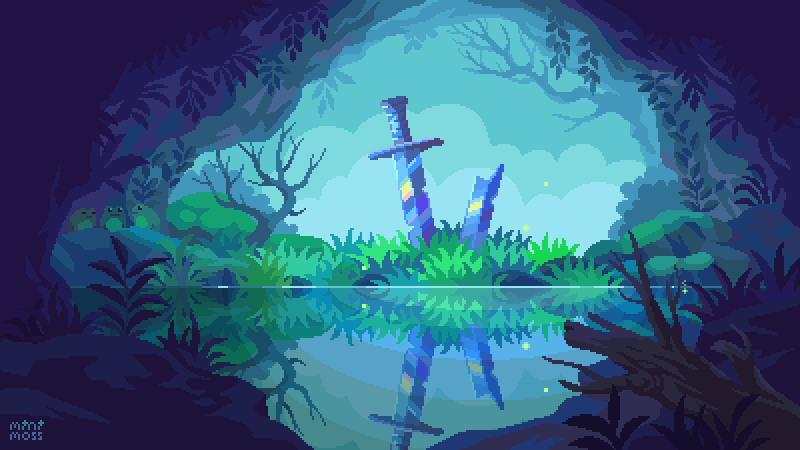

# Hi there, I'm Mαx 👋

I'm an 19-year-old French student 🥐. I love new technologies, so I try to learn as much as I can 💻. As of now, I mainly learned Java, TypeScript, Python, HTML, CSS and SQL but recently took a liking to Assembly, Rust and C++ 🧠.
I try to be as versatile as possible, which is why I'm also learning UX and UI 🪄.

## My Current Projects :clipboard:
- **Draftbot** 👑: A javascript Discord bot with a unique and constantly developing RPG system. 
(Available at <a href="https://github.com/DraftBot-A-Discord-Adventure" target="_blank">github.com/DraftBot-A-Discord-Adventure</a>) 
- **Suivix** 📑: A Discord bot with a web interface to take attendance and create amazing polls. 
(Available at <a href="https://suivix.xyz" target="_blank">suivix.xyz</a>)
- **TFJM-2023** ✍🏻: Two different approaches to modeling a complex mathematical problem at the "Tournois Français des Jeunes Mathématiciens et Mathématiciennes" using a web interface to make mathematical conjectures. 
(Available at <a href="https://mw3y.github.io/TFJM-2023" target="_blank">mw3y.github.io/TFJM-2023</a>)
- **PokéMAN** 👾: A Pokémon game where you're a first semester student in Computer Sciences at EPFL and you have to challenge the league of professors and beat the master (our programming teacher) to pass the semester and avoid the MàN (catch-up). 
(Available at <a href="https://github.com/Mw3y/PokeMAN" target="_blank">github.com/Mw3y/PokeMAN</a>)
- **ChaCuN** 🍖: An electronic version of the board game 'Chasseurs et Cueilleurs', derived from the famous 'Carcassonne'. It has multiplayer support ;) 
  - Singleplayer game: <a href="https://github.com/Mw3y/ChaCuN" target="_blank">github.com/Mw3y/ChaCuN</a>
  - Multiplayer server: <a href="https://github.com/Mw3y/cs108-chacun-ws-server" target="_blank">github.com/Mw3y/cs108-chacun-ws-server</a>
- **S4S Programmation Labs** 👨‍💻: A website to help new EPFL students learn programming through intuitive exercises in 3 different code languages, without installing anything on their computer.
(Available at <a href="https://github.com/students-4-students/prog-labs-website" target="_blank">github.com/students-4-students/prog-labs-website</a>)

## Find me around the web 🌎
- Behance 🖌️: <a href="https://behance.net/mw3y" target="_blank">behance.net/mw3y</a>
- Discord 💬: @max0253

<!-- # 📊 GitHub Stats:
 
 

 -->
